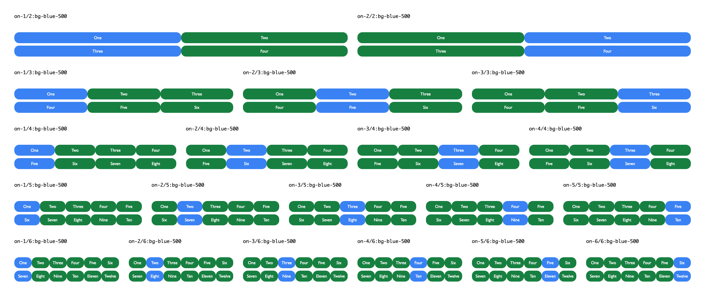

# Tailwind 'on' variants.




# What is this?

This simple tailwind plugin will define 20 new variants that make it simple to select the Xth child, every Y children.

Simple use-case: 

You have a flexbox with three children (33%) of the width. There are many children all on `flex-wrap`.

You want to change the background to red on the second child on each row.

Well, you can use the variant `on-2/3:bg-red-300`.

## The Variants:

- `on-1/2` = The odd child element.
- `on-2/2` = The even child element.

- `on-1/3` = The first of every three child elements.
- `on-2/3` = The second of every three child elements.
- `on-3/3` = The third of every three child elements.

- `on-1/4` = The first of every four child elements.
- `on-2/4` = The second of every four child elements.
- `on-3/4` = The third of every four child elements.
- `on-4/4` = The fourth of every four child elements.

- `on-1/5` = The first of every five child elements.
- `on-2/5` = The second of every five child elements.
- `on-3/5` = The third of every five child elements.
- `on-4/5` = The fourth of every five child elements.
- `on-5/5` = The fifth of every five child elements.

- `on-1/6` = The first of every six child elements.
- `on-2/6` = The second of every six child elements.
- `on-3/6` = The third of every six child elements.
- `on-4/6` = The fourth of every six child elements.
- `on-5/6` = The fifth of every six child elements.
- `on-6/6` = The fifth of every six child elements.


## Installation

Within your tailwind.config.js, do these steps:

1. `require()` the tailwind-on.js file in this repo.
2. add which utility you want the variant added to. (Remember you need to escape the backslash with a forward-slash.)
3. Remember to recompile your stylesheet using `postcss` 


```
const plugin = require('tailwindcss/plugin');

module.exports = {

  plugins: [
    require('./plugins/tailwind-on'),
  ],

  variants: {
    extend: {
      margin: ['on-2\/3'],
    },
  },

}
```


## Note

By adding many variants, your CSS file will grow very large. Make sure you are only using the ones you need and make sure you
purge any CSS too.

## All Includes

```
const plugin = require('tailwindcss/plugin');

module.exports = {

  plugins: [
    require('./plugins/tailwind-on'),
  ],

  variants: {
    extend: {
       backgroundColor: [
        'on-1\/2', 'on-2\/2', 
        'on-1\/3', 'on-2\/3', 'on-3\/3', 
        'on-1\/4', 'on-2\/4', 'on-3\/4', 'on-4\/4', 
        'on-1\/5', 'on-2\/5', 'on-3\/5', 'on-4\/5', 'on-5\/5',
        'on-1\/6', 'on-2\/6', 'on-3\/6', 'on-4\/6', 'on-5\/6', 'on-6\/6', ],
    },
  },

}
```
